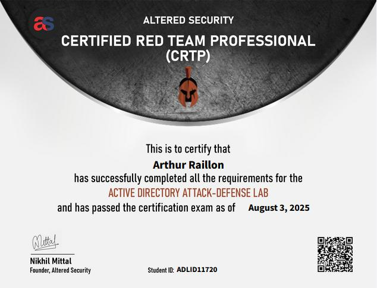
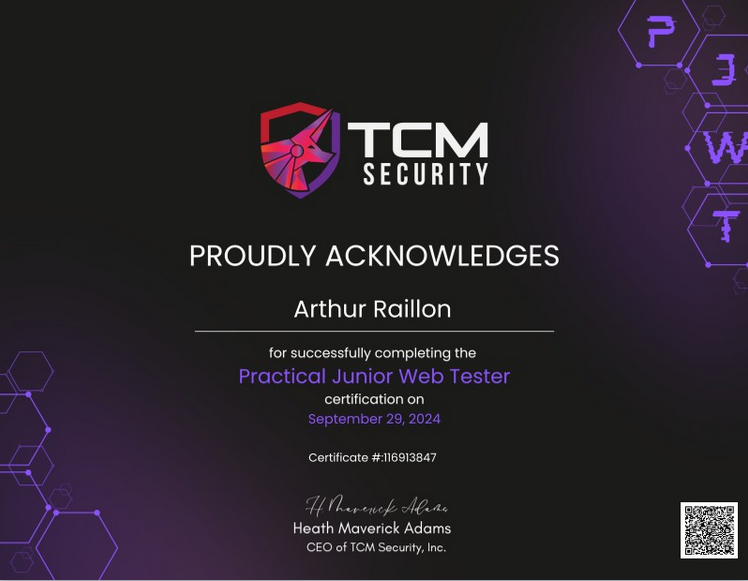
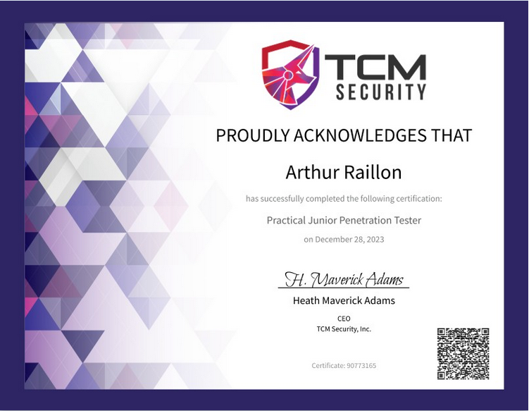

# Certifications

## CRTP

The `CRTP` (**C**ertified **R**ed **T**eam **P**rofessional)

  

## PWPP

The `PWPP` (**P**ractical **W**eb **P**entest **P**rofessional)

  

## PWPA

The `PWPA` (**P**ractical **W**eb **P**entest **A**ssociate)

  

## PJPT

The `PJPT` (**P**ractical **J**unior **P**enetration **T**ester)

  

