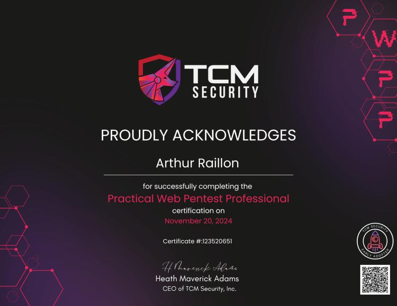

# Certifications

## CRTP

The `CRTP` (**C**ertified **R**ed **T**eam **P**rofessional), is the latest certification I passed, annnnd well...I struggled for this one to be honest, had to re-watch the course material multiple time (In hindsight, It was because I wasnt focused enough when viewing the videos...)

It contains advanced Active Direcory content, learned a LOOOOT of things that allowed me to get a better understanding of AD, and the most important part, about all the possible vulnerable stuff we can find.

I would recommend to have a basic understanding on AD and common attacks.

The 24h exam is really challenging, but worth it.
More information [here](https://www.alteredsecurity.com/post/certified-red-team-professional-crtp)

  

## PWPP

The `PWPP` (**P**ractical **W**eb **P**entest **P**rofessional) is the certification above the PWPA, the concept learned are on an advance level conmpare to the associate one.

Very great courses and exam, more complicated than PWPA for sure, but amazing.More infos [here](https://certifications.tcm-sec.com/pwpp/)

  

## PWPA

The `PWPA` (**P**ractical **W**eb **P**entest **A**ssociate) is an entry-level certification to *"discover"* the bug bounty world. 

Before starting the course and taking the exam I already had some experience with web pentest, but wanted to reinforce my skills.

Alex is a really good instructor, and very good hands-on exam, really loved it.

This is for beginners who wants to enter the bug bounty world, loved it 10/10.
More infos [here](https://certifications.tcm-sec.com/pwpa/)

  

## PJPT

The `PJPT` (**P**ractical **J**unior **P**enetration **T**ester) was the first ever certification I passed in the cybersecurity field, It was also my first introduction to AD (**A**ctive **D**irectory).

Through the courses from *TCM Security*, I learned a lot of things regarding AD and really enjoyed the exam.

I would recommend this certification to anyone willing to make their first step in AD. You can find more inormaion [here](https://certifications.tcm-sec.com/pjpt/)

  

